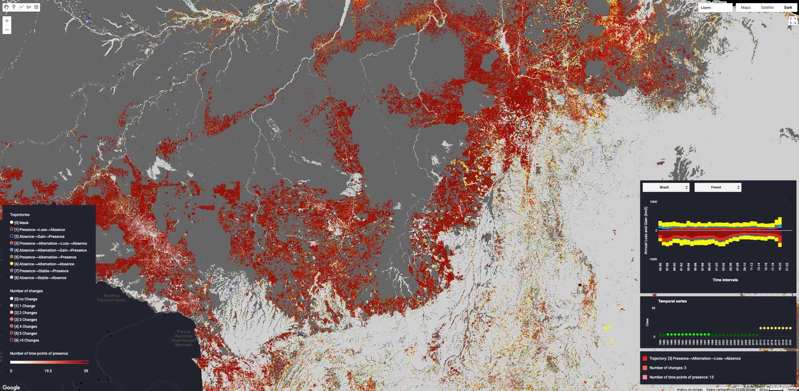

# Beyond Net Change: Four Decades of LULC Trajectories Across Brazilian Biomes

Interactive Google Earth Engine dashboard for analyzing Land Use and Land Cover (LULC) trajectories using MapBiomas Brazil Collection 10 data (1985–2024). Implements the trajectory classification method from Bilintoh et al. (2024) to categorize pixel-level land change dynamics into eight trajectories.

Source code for *Fonseca et al. (2026)* — "Beyond net change: four decades of land cover and land use trajectories across Brazilian biomes."



## How to use

1. Open the [GEE Code Editor](https://code.earthengine.google.com)
2. Copy the contents of `trajectories.js` into the editor
3. Click **Run**

The script loads MapBiomas Collection 10 data, remaps the original 49 classes, computes trajectory metrics, and displays the interactive dashboard.

## What the script does

- **Trajectory classification** — classifies each pixel into one of eight trajectory categories (Table 2 in the paper) for eight LULC classes across all six Brazilian biomes
- **Point inspector** — click any location to view its trajectory category, number of changes, and number of presence years
- **Time series chart** — click a point to see the annual class value across the full 1985–2024 time series
- **Loss/Gain chart** — interactive bar chart of annual loss and gain area (km²) by trajectory type, with biome and class selectors
- **Area export** — computes trajectory-class area per biome and exports to Google Drive as CSV

## Classes of interest

| ID | Class |
|----|-------|
| 3 | Forest Formation |
| 4 | Savanna Formation |
| 11 | Wetland |
| 12 | Grassland |
| 15 | Pasture |
| 18 | Agriculture (Cropland) |
| 24 | Urban Area |
| 33 | Water |

## Trajectory categories

| TR | Name | Description |
|----|------|-------------|
| 1 | Loss without alternation | Presence → Loss → Absence |
| 2 | Gain without alternation | Absence → Gain → Presence |
| 3 | Loss with alternation | Presence → Alternation → Loss → Absence |
| 4 | Gain with alternation | Absence → Alternation → Gain → Presence |
| 5 | All alternation, loss first | Presence → Alternation → Presence |
| 6 | All alternation, gain first | Absence → Alternation → Absence |
| 7 | Stable presence | Presence → Stable → Presence |
| 8 | Stable absence | Absence → Stable → Absence |

Adapted from Bilintoh, T. M., Pontius, R. G., & Zhang, A. (2024). Methods to compare sites concerning a category's change during various time intervals. *GIScience & Remote Sensing, 61*(1). https://doi.org/10.1080/15481603.2024.2409484

## Script structure

```
trajectories.js
├── 1. Assets & remapping       — loads Collection 10, remaps 49 → ~30 classes
├── 2. Trajectory metrics       — number of presence, number of changes, 8-category classification
├── 3. Dashboard                — three UI widgets: point inspector, time series chart, loss/gain chart
├── 4. Area export              — trajectory area per biome → Google Drive CSV
└── 5. Legend                   — legend panel, color ramps, state boundaries
```

## External assets

The script requires read access to these Earth Engine assets:

| Asset | Purpose |
|-------|---------|
| `projects/mapbiomas-public/assets/brazil/lulc/collection10/mapbiomas_brazil_collection10_coverage_v2` | LULC maps (Collection 10) |
| `projects/mapbiomas-territories/assets/TERRITORIES/LULC/BRAZIL/COLLECTION9/dashboard` | Territory/biome raster |
| `projects/mapbiomas-workspace/AUXILIAR/biomas-2019-raster` | Biomes raster (chart widget) |
| `projects/mapbiomas-workspace/AUXILIAR/estados-2017--` | State boundaries |
| `projects/nexgenmap/MapBiomas_TOOLs/Trajectories/Trajs_image_col9` | Reference trajectories image |
| `users/joaovsiqueira1/brazil-country-trajectorties-3c` | Pre-computed country-level area tables |
| `users/joaovsiqueira1/brazil-biomes-trajectorties-3c` | Pre-computed biome-level area tables |

## References

Bilintoh, T. M., Pontius, R. G., & Zhang, A. (2024). Methods to compare sites concerning a category's change during various time intervals. *GIScience & Remote Sensing, 61*(1). https://doi.org/10.1080/15481603.2024.2409484

Fonseca, M., Rosa, M., Shimbo, J. Z., Ramos Neto, M. B., Matos, A. P., Lupinetti-Cunha, A., Conciani, D., Rosa, E., Vélez-Martin, E., Siqueira, J., Mourão, K., Oliveira Jr, L. A., Ramos, M., Crusco, N., & Azevedo, T. (2026). Beyond net change: four decades of land cover and land use trajectories across Brazilian biomes.
